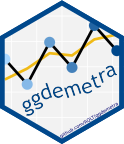

<!-- README.md is generated from README.Rmd. Please edit that file -->

```{r, echo = FALSE}
knitr::opts_chunk$set(
  collapse = TRUE,
  comment = "#>",
  fig.path = "man/figures/README-",
  fig.align = "center",
  fig.dim = c(7,4)*1.4,
  out.width = "100%",
  warning = FALSE
)
```

# ggdemetra 

[](https://github.com/AQLT/ggdemetra/actions)
[](https://cran.r-project.org/package=ggdemetra)
[](https://cran.r-project.org/package=ggdemetra)
[](https://cran.r-project.org/package=ggdemetra)
[](https://cran.r-project.org/package=ggdemetra)

## Overview

```{=markdown}
ggdemetra is an extension of [ggplot2](https://github.com/tidyverse/ggplot2) to add seasonal adjustment statistics to your plots. The seasonal adjustment process is done with [RJDemetra](https://github.com/jdemetra/rjdemetra) that is an R interface to [JDemetra+](https://github.com/jdemetra/jdemetra-app), the seasonal adjustment software [officially recommended](<https://cros-legacy.ec.europa.eu/system/files/Jdemetra_ release.pdf>) to the members of the European Statistical System (ESS) and the European System of Central Banks. RJDemetra implements the two leading seasonal adjustment methods [TRAMO/SEATS+](https://gretl.sourceforge.net/tramo/tramo-seats.html) and [X-12ARIMA/X-13ARIMA-SEATS](https://www.census.gov/data/software/x13as.html).
```

There are 4 main functionnalities in `ggdemetra` depending of what you want to add in the graphic:

- `geom_sa()`: to add a time series compute during the seasonal adjustment (the trend, the seasonal adjusted time series, etc.).  
- `geom_outlier()`: to add the outliers used in the pre-adjustment process of the seasonal adjustment.
- `geom_arima()`: to add the ARIMA model  used in the pre-adjustment process of the seasonal adjustment.
- `geom_diagnostics()`: to add a table containing some diagnostics on the seasonal adjustment process.

## Installation

Since RJDemetra requires Java SE 8 or later version, the same requirements are also needed for ggdemetra.

```{r, eval = FALSE}
# Install release version from CRAN
install.packages("ggdemetra")

# Install development version from GitHub
# install.packages("devtools")
devtools::install_github("AQLT/ggdemetra")
```

If you have troubles with the installation of RJDemetra, check the [installation manual](https://github.com/jdemetra/rjdemetra/wiki/Installation-manual).

## Usage

By default, the seasonal adjustment is made with X-13-ARIMA with the pre-defined specification "RSA5c"  (automatic log detection, automatic ARIMA and outliers detection and trading day and easter adjustment). 
If no new data or seasonal adjustment specification is specified (method or specification), these parameters is inherited from the previous defined: therefore you only need to specify the specification once. 
In the following examples, the seasonal adjustment will be perform with X-13-ARIMA with working day adjustment and no gradual easter effect adjustment (it is the specification that has the most economic sense for the industrial production index).

To add the seasonal adjusted series and the forecasts of the input data and of the seasonal adjusted series:
```{r sa, warning=FALSE, message=FALSE}
library(ggplot2)
library(ggdemetra)
spec <- RJDemetra::x13_spec("RSA3", tradingdays.option = "WorkingDays")
p_ipi_fr <- ggplot(data = ipi_c_eu_df, mapping = aes(x = date, y = FR)) +
    geom_line(color =  "#F0B400") +
    labs(title = "Seasonal adjustment of the French industrial production index",
         x = NULL, y = NULL)
p_sa <- p_ipi_fr +
    geom_sa(component = "y_f", linetype = 2,
            spec = spec, frequency = 12, color =  "#F0B400") + 
    geom_sa(component = "sa", color = "#155692") +
    geom_sa(component = "sa_f", color = "#155692", linetype = 2)
p_sa
```

To add the outliers at the bottom of the plot with an arrow to the data point and the estimated coefficients:
```{r sa-out}
p_sa + 
    geom_outlier(geom = "label_repel",
                 coefficients = TRUE,
                 ylim = c(NA, 65), 
                 arrow = arrow(length = unit(0.03, "npc"),
                               type = "closed", ends = "last"),
                 digits = 2)
```

To add the ARIMA model:

```{r sa-arima}
p_sa + 
    geom_arima(geom = "label",
               x_arima = -Inf, y_arima = -Inf, 
               vjust = -1, hjust = -0.1)
```

To add a table of diagnostics below the plot:
```{r sa-diag}
diagnostics <- c(`Combined test` = "diagnostics.combined.all.summary",
                 `Residual qs-test (p-value)` = "diagnostics.qs",
                 `Residual f-test (p-value)` = "diagnostics.ftest")
p_diag <- ggplot(data = ipi_c_eu_df, mapping = aes(x = date, y = FR)) +
    geom_diagnostics(diagnostics = diagnostics,
                     table_theme = gridExtra::ttheme_default(base_size = 8),
                     spec = spec, frequency = 12) + 
    theme_void()
    
gridExtra::grid.arrange(p_sa, p_diag,
             nrow = 2, heights  = c(4, 1.5))
```

See the [vignette](https://aqlt.github.io/ggdemetra/articles/ggdemetra.html) for more details.

Note that `ts` objects cannot be directly used in `ggplot2`.
To convert `ts` or `mts` object to `data.frame`, you can use the `ts2df()` function.
For example, the data `ipi_c_eu_df` used in this package is obtained by applying the  `ts2df()`function to the `ipi_c_eu` data available in RJDemetra:
```{r, eval = FALSE}
ipi_c_eu_df <- ts2df(ipi_c_eu)
```


## Existing models

ggdemetra offers several function that can be used to manipulate existing models.

The different components of seasonal adjustment models can be extracted through  `calendar()`, `calendaradj()`, `irregular()`, `trendcycle()`, `seasonal()`, `seasonaladj()`, `trendcycle()` and `raw()`.

If you already have a seasonally adjusted model you can also used the function `init_ggplot()` :
```{r sa-init}
spec <- RJDemetra::x13_spec("RSA3", tradingdays.option = "WorkingDays")
mod <- RJDemetra::x13(ipi_c_eu[,"FR"], spec)
init_ggplot(mod) +
    geom_line(color =  "#F0B400") +
    geom_sa(component = "sa", color = "#155692")
```

There is also an `autoplot()` function:

```{r autoplot}
autoplot(mod)
```

SI-ratio plots can be plotted with `siratioplot` and `ggsiratioplot`:

```{r ggsiratio}
ggsiratioplot(mod)
```
